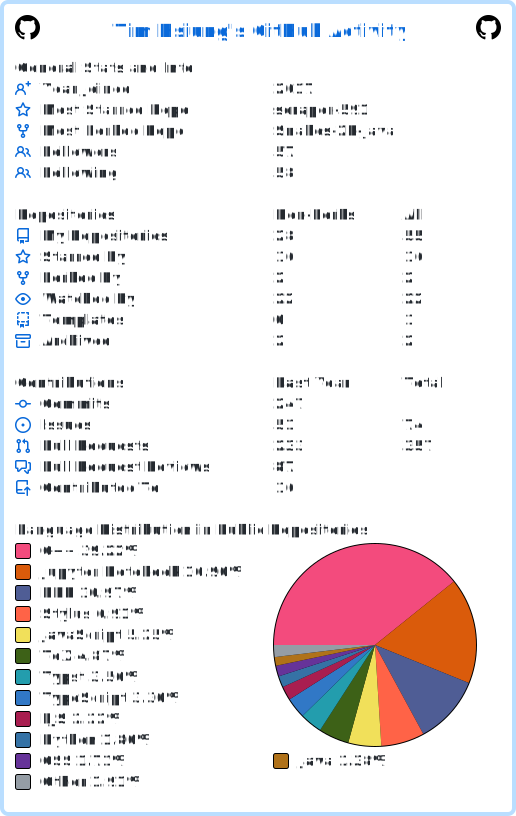

# Hi, I'm Tim Hsiung

Software Engineer at Microsoft Taiwan, working on the Power BI / Analysis Services engine. Open-source maintainer and tooling enthusiast.

## Currently

- Maintaining [commitizen](https://github.com/commitizen-tools/commitizen) — bug triage, PR reviews, conventional-commit tooling
- Building Copilot CLI workflows — skills, agents, dotfiles for sustained AI-assisted development
- Active attendee of [opensource4you](https://github.com/opensource4you/readme) in Taiwan

## Find me

[GitHub](https://github.com/bearomorphism) · [Linktree](https://linktr.ee/bearomorphsim) · [LeetCode](https://leetcode.com/Mrbear666/)

